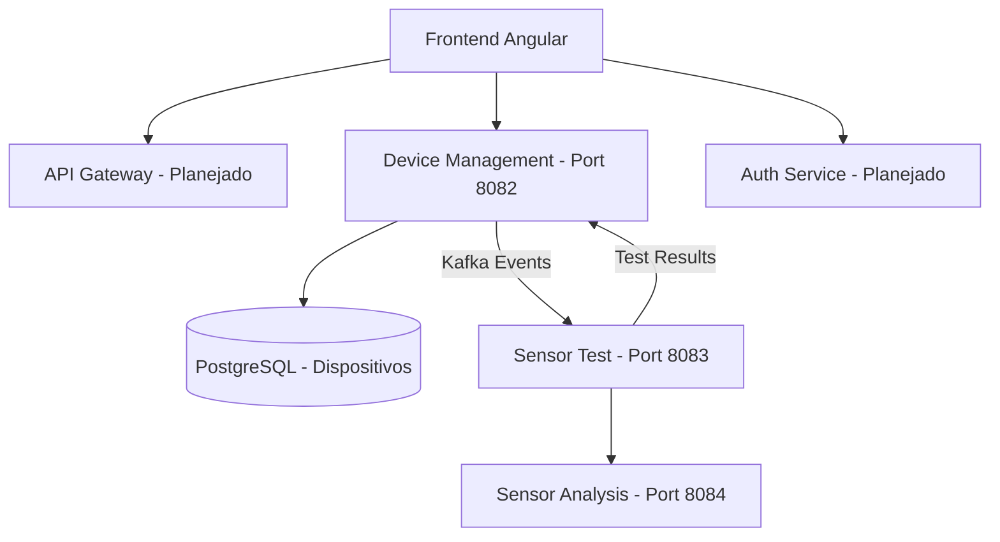

# Device Management System - Backend

Sistema de gerenciamento de dispositivos IoT com arquitetura de microserviços, desenvolvido com Spring Boot e Apache Kafka.


## Índice
- Arquitetura
- Tecnologias
- Funcionalidades
- Comunicação
- Como Executar
- Estrutura do Projeto
- Roadmap
- Contribuindo
- Licença

## Arquitetura



### Fluxo de Comunicação
- Frontend Angular consome APIs REST para CRUD de dispositivos
- Device Management agenda testes no Sensor Test via Kafka
- Sensor Test executa testes e publica resultados no Kafka
- Sensor Analysis consome os resultados para análise
- Device Management atualiza o status dos dispositivos

## Tecnologias

### Backend
- Java 21
- Spring Boot 3.1.5
- Spring Kafka
- Feign Client
- Spring Data JPA
- Spring Scheduling

### Banco de Dados
- PostgreSQL 15 (dados transacionais)

### Infraestrutura
- Docker
- Docker Compose
- Apache Kafka

### Ferramentas
- Maven
- Lombok
- MapStruct

## Funcionalidades

### Device Management Service (Port 8082)
- CRUD completo de dispositivos IoT
- Validações em tempo real
- Gerenciamento de status (ACTIVE, INACTIVE, TESTING)
- Comunicação síncrona entre serviços
- Persistência em PostgreSQL

### Sensor Test Service (Port 8083)
- Testes automáticos e agendados de sensores
- Configuração flexível de intervalos
- Publicação de eventos no Apache Kafka
- Políticas de retry para falhas
- Logs detalhados de execução

### Sensor Analysis Service (Port 8084)
- Análise em tempo real dos dados dos sensores
- Detecção de anomalias com algoritmos de Machine Learning
- Alertas automáticos
- Dashboard de métricas (planejado)
- Armazenamento em MongoDB

## Comunicação
- Comunicação síncrona via REST APIs
- Comunicação assíncrona via Apache Kafka
- Mensagens em formato JSON padronizado
- Schema Registry para validação de eventos (planejado)

## Como Executar

### Pré-requisitos
- Docker 24.0 ou superior
- Docker Compose
- Java 17 ou superior (desenvolvimento local)
- Maven 3.8 ou superior (desenvolvimento local)
- Mínimo de 4GB de RAM disponível

### Execução
```bash
docker-compose up -d
```

## Estrutura do Projeto
```
device-management-system
├── device-management-service
├── sensor-test-service
├── sensor-analysis-service
├── docker-compose.yml
└── README.md
```

## Roadmap
- Implementação do API Gateway
- Implementação do Auth Service
- Integração com Schema Registry
- Dashboard de métricas em tempo real
- Observabilidade com Prometheus e Grafana

## Contribuindo
1. Fork o projeto
2. Crie uma branch para sua feature
3. Commit suas alterações
4. Push para a branch
5. Abra um Pull Request

## Licença
Este projeto está sob a licença MIT. Consulte o arquivo LICENSE para mais informações.

